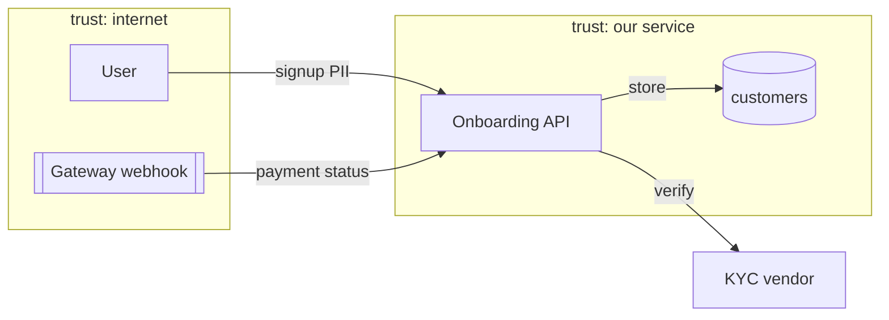

# Building the data-flow diagram (DFD)

A threat model is only as good as its DFD. Enumerate the elements of the **one flow** in scope, draw
the **trust boundaries**, and you have located where to look for threats.

## The four element types
1. **External entity** — an actor outside your trust that initiates or receives: end user (web/
   mobile), backoffice operator, partner/aggregator API, payment **gateway webhook**, batch/cron job,
   the attacker. Drawn as a source/sink; you do not control it.
2. **Process** — code that transforms or routes: an HTTP handler, a service method, a worker, a
   serverless function, the auth middleware, the KYC decision engine, the ledger poster.
3. **Data store** — where data rests: DB tables, cache (Redis), queue/topic, object storage
   (documents/video), secret store, log/audit store, third-party vault.
4. **Data flow** — a directed edge: a request, a DB query, a queue publish, an outbound API call —
   labelled with **what data it carries** (PII? money amount? token?).

## Finding trust boundaries (where threats cluster)
A trust boundary is any line where the level of trust changes. Mark every crossing:
- **Internet ↔ service** — untrusted input enters (every public endpoint).
- **Service ↔ third party** — gateway/UPI/bureau/KYC vendor; data leaves and responses return.
- **App ↔ data store** — queries, and the DB's own privileges over audit/ledger tables.
- **User role ↔ elevated role** — customer vs backoffice/admin; maker vs checker.
- **Tenant ↔ tenant** — multi-tenant isolation in backoffice/SaaS.
- **Network zone ↔ zone** — DMZ vs internal; VPC boundaries; client vs server (what runs in the
  browser is untrusted).
- **Prod ↔ non-prod** — data copied across (a `pii-guard` P-NONPROD concern).

For each crossing, the data flow over it gets **S** (is the sender authentic?), **T** (can it be
modified?), and **I** (is it confidential?) at minimum.

## Seeding the DFD from code
When given a path, use `scripts/scan.sh` to list concrete elements:
- **Entry points** (routes/handlers) → processes + the internet boundary.
- **External calls** (HTTP/gRPC/SDK) → third-party boundaries + data flows.
- **Data stores** (DB/cache/queue/object/secret access) → store elements.
- **Auth/authz checks** → where the role boundary is (or is missing).
- **File uploads / queues** → high-value processes (KYC docs, async money flows).
Then prune to the elements that actually participate in the flow you are modelling.

## Representing it
A list is fine; a mermaid diagram is clearer for a saved model:

Label trust boundaries (the `subgraph`s) explicitly — they are the map for STRIDE in `stride.md`.

## Scope discipline
Model **one** journey (onboarding, a single payment, a payout, a backoffice approval). If asked for
"the whole system", list its top journeys and model them one at a time — a giant DFD yields a
shallow, unusable model.
